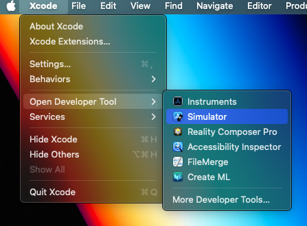

# 📱 React Native Photo Gallery App

This is a comprehensive guide to build a **[React Native](https://reactnative.dev/)** Application using the **[Expo Framework](https://docs.expo.dev/)**. Basically it's a Photo Gallery Application with infinite scroll that interacts with the **[Picsum API](https://picsum.photos/)** to obtain images.

## 📸 Screenshots

<<<<<<< HEAD
=======


https://github.com/asx-dev/Photo-Gallery-App/assets/103829056/439b0473-8926-4d51-bbf7-43b091adf4d8


>>>>>>> refs/remotes/origin/main
## 🔥 Key takeaways

- Interact with and API.
- Use the FlatList Component (React Native Core Component).
- How to use useReducer (Update State).
- How to run the project in an IOS / Android Simulator.

## 💻 Project Structure

```bash
PhotoGallery
├── api
│   └── picsum.js
├── components
│   └── PhotoGrid.js
├── reducers
│   └── photos.js
└── App.js
```

### ⚙️ Configuration

To build this project you need to set up your development environment. You will need to install the following:

1. **[Node.js](https://nodejs.org/en)**: Node.js is an open-source, cross-platform JavaScript runtime environment that allows developers to run Javascript code in the server-side. React Native relies on Node.js and npm to install dependencies and manage packages.
2. **[Xcode](https://developer.apple.com/xcode/)**: Xcode enables you to develop, test and distribute apps for all Apple platforms.
3. **[Android Studio](https://developer.android.com/studio)**: Official Integrated Development environment for Android app development.
4. **[Expo Framework](https://expo.dev/)**: Expo is an open-source platform for making universal native applications that run on Android, IOS and the Web. The Expo framework it doesn't need to be installed you just need to run this command in your terminal.

   ```bash
   Create the project
   npx create-expo-app my-app

   Run the project
   npm start
   ```

_You are going to use Xcode and Android Studio just to run the simulator for the app._

### 🍎 IOS Simulator

In order to run the app in the IOS simulator you need to open xcode and start the simulator and then press the command `i` in the terminal. (You need a MacBook to install Xcode)




### 🤖 Android Simulator

In order to run the app in the Android simulator you need to open the simulator and then press the command `a` in the terminal.


## 1️⃣ Getting Started

First we need to create the method that interacts with the Picsum API to fetch the images. The method needs to be asynchronous and receive a `page` parameter to reuse the same method when requesting more images.

🗂️ **api/picsum.js**

```javascript
const API_URL = "https://picsum.photos/v2/list";

export const getImages = async (page = 1) => {
  try {
    const data = await fetch(`${API_URL}?page=${page}`);
    const photos = await data.json();
    return photos;
  } catch (error) {
    console.log(error);
  }
};

export const formatImage = (id, size) => {
  return `https://picsum.photos/id/${id}/${size}`;
};
```

📸 **Image format**

```bash
[
    {
        "id": "0",
        "author": "Alejandro Escamilla",
        "width": 5616,
        "height": 3744,
        "url": "https://unsplash.com/...",
        "download_url": "https://picsum.photos/..."
    }
]
```

The second method is used to format the images based on the device screen-size. The main idea is the following, we fetch the images with the `getImages` method and then use the id's to get a specific version of every image. The `API_URL` is the based url to get a list of images from the Picsum API and the second url is used to get an image with a specific size.

_Check the [Picsum API](https://picsum.photos/) website to see more methods_

## 2️⃣ Manage State

Now we need to use the [useReducer](https://react.dev/reference/react/useReducer) hook to manage the state in our application, `useReducer()` is hook for managing the state in more complex and structural way. It accepts a reducer function and an initial state and returns the current state and a `dispatch()` function. The `dispatch()` function is used to dispatch actions to the reducer.

1. **Reducer** (Actions to be executed)
2. **Actions** (Type of actions)
3. **Initial** State (State to be manage)

🗂️ **reducers/photos.js**

```javascript
export const types = {
  LOADING: "LOADING",
  FAILURE: "FAILURE",
  SUCCESS: "SUCCESS",
};

export const initialState = {
  loading: false,
  failure: false,
  nextPage: 1,
  photos: [],
};

export const actionsCreator = {
  loading: () => ({ type: types.LOADING }),
  failure: () => ({ type: types.FAILURE }),
  success: (photos, page) => ({
    type: types.SUCCESS,
    payload: { photos, page },
  }),
};

export const reducer = (state, action) => {
  switch (action.type) {
    case types.LOADING:
      return { ...state, loading: true };
    case types.SUCCESS:
      return {
        ...state,
        success: true,
        loading: false,
        photos: [...state.photos, ...action.payload.photos],
        nextPage: state.nextPage + 1,
      };
    case types.FAILURE:
      return { ...state, failure: true, loading: false };
  }
};
```

## 3️⃣ Presentational Component

For displaying the images we are going to use the [FlatList component](https://reactnative.dev/docs/flatlist). Such component is a React Native Core component
used for rendering performant scrollable lists.

**FlatList props**

- data (Data to be displayed)
- keyExtractor (Assign unique keys to each element)
- numColumns (Number of columns)
- onEndReached (Function called when the end of the list is reached)

🗂️ **components/PhotoGrid.js**

```javascript
import { FlatList, Image, Dimensions } from "react-native";
import { formatImage } from "../api/picsum";

const PhotoGrid = ({ photos, numColumns, onEndReached }) => {
  const windowWidth = Dimensions.get("window").width;
  const imageSize = windowWidth / numColumns;
  return (
    <FlatList
      data={photos}
      keyExtractor={(item) => item.id}
      numColumns={numColumns}
      onEndReached={onEndReached}
      renderItem={({ item }) => (
        <Image
          source={{
            uri: formatImage(item.id, imageSize),
            width: imageSize,
            height: imageSize,
          }}
        />
      )}
    />
  );
};

export default PhotoGrid;
```

## 4️⃣ Fetch and render images

The final step is putting all together.

1. Fetch the images with the method `getImages()`.
2. Dispatch the actions to the reducer.
3. Pass the data to the PhotoGrid component.

🗂️ **Photo-Gallery/App.js**

```javascript
import { StatusBar } from "expo-status-bar";
import { StyleSheet, View } from "react-native";
import { useReducer, useEffect, useCallback } from "react";
import { initialState, actionsCreator, reducer } from "./reducers/photos";
import Loading from "./components/Loading";
import Error from "./components/Error";
import PhotoGrid from "./components/PhotoGrid";
import { getImages } from "./api/picsum";

export default function App() {
  const [state, dispatch] = useReducer(reducer, initialState);
  const { loading, nextPage, failure, photos } = state;

  const fetchImages = useCallback(async () => {
    dispatch(actionsCreator.loading());
    try {
      const nextPhotos = await getImages(nextPage);
      dispatch(actionsCreator.success(nextPhotos, nextPage));
    } catch (error) {
      console.log(error);
      dispatch(actionsCreator.failure());
    }
  }, [nextPage]);

  useEffect(() => {
    fetchImages();
  }, []);

  if (photos.length === 0) {
    if (loading) {
      return <Loading />;
    }

    if (failure) {
      return <Error />;
    }
  }

  return (
    <View style={styles.container}>
      <PhotoGrid photos={photos} numColumns={3} onEndReached={fetchImages} />
      <StatusBar style="light" />
    </View>
  );
}

const styles = StyleSheet.create({
  container: {
    flex: 1,
    backgroundColor: "#fff",
    alignItems: "center",
    justifyContent: "center",
  },
});
```

The `fetchImages()` function is responsible for fetching the images and dispatching the actions to the reducer. This method uses the [useCallback](https://react.dev/reference/react/useCallback) hook for memoizing the function.

- **Memoized function**: Function that remembers its output for a given set of inputs. If the function is called with the same input value it returns the cached output.
